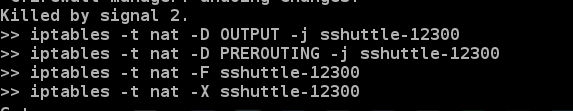

[sshuttle全局代理的实现简析](/cnsword/article/details/16994059)
===============================================================

最近使用sshuttle实现全局代理，顺便研究了一下实现的具体原理。

直接进入主题，先看一下启动的输出信息：

先绑定到本地的12300端口，将数据通过远端的ssh服务器进行路由转发。sshuttle和ssh的tunnle不同不是基于TCP-over-TCP的，而是叫data over tcp的，省去了一次包裹。然后建立端口映射，输出信息如下：

很明显是通过iptables的代理转发来实现的，具体步骤：

1.  新建nat表的处理链sshuttle-12300
2.  清空处理链
3.  将OUTPUT数据路由给sshuttle-12300处理
4.  添加sshuttle-12300的处理过程，目标是本机则返回，目标是远程主机的tcp转发REDIRECT到12300端口，目标是dns服务器的udp数据通过12300端口来转发

当然代理结束时就会将映射信息从iptables中删除：

sshuttle是使用python实现的，安装很方便几乎是直接portable的。当然如果条件限制可以先使用ssh tunnle然后通过iptables的转发来实现代理。其实不光是sshuttle，android的gae代理也是基于这个iptables来实现的。
